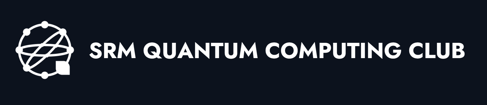
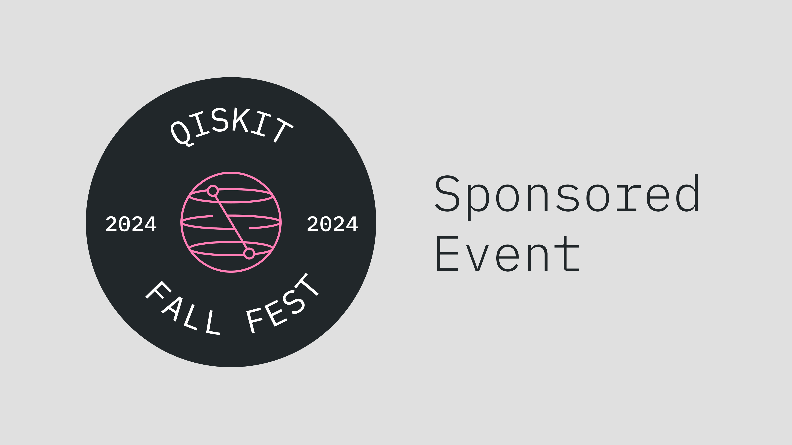

# Qiskit Fall Fest 2024
|

## Welcome

This is the Qiskit Fall Fest event for SRM Institute of Science and Technology. We're so excited to have you all here. This event is being hosted by the SQCC club, the quantum tech club of SRM KRT.

The SRM Quantum Computing Club is a dynamic student organization at SRM University, united by a passion for quantum computing. Through engaging workshops and interactive sessions, we explore quantum mechanics, algorithms, and practical applications. Hands-on learning with cutting-edge platforms like Qiskit and Cirq enhances our problem-solving skills and understanding.

The Qiskit Fall Fest is a collection of quantum computing events on college campuses around the world. Every Fall Fest event is organized and run by the students on each campus, with support from the entire IBM Quantum team. Student leaders work alongside IBM to host tech events. The events vary from technical hackathons to beginner-friendly challenges, all with the goal of helping to grow the local community’s skill set.

The Fall Fest here at SRM University is going to be a Quantum challenges, starting on October. Details about the challenges and rules can be found below. The deadline for Registration TBA IST. Good luck!
## Official Registration

To officially sign up, register using [this link](https://docs.google.com/forms/d/e/1FAIpQLSfYq8-mhZO2vU5-5CcUDw_y3F9WQtloS2lSUKJmppIwXC2UXw/viewform?usp=sf_link)

## Schedule

We are proud to welcome you to the SQCC Qiskit Fall Fest. Our team of organizers has put together an amazing schedule of events, learning, guest speakers, and more for you. Find the schedule below:

### Wednesday - 16/10/2024

| Event                | Time       |
| ---------------------| ---------- |

## Schedule

### 11:00 AM - 11:30 AM: Opening Ceremony
- Join us as we kick off this exciting event with an opening ceremony that sets the stage for a day of quantum exploration.

### 11:30 AM - 12:00 PM: Introduction to Quantum Mini-Talk
- Get started with a brief yet informative introduction to the world of quantum computing.

### 12:00 PM - 1:00 PM: Quantum Talk #1
- Dive deeper into the world of quantum computing with our first captivating talk of the day.

### 1:10 PM - 2:00 PM: Break
- Breaktime!

### 2:10 PM - 3:00 PM: Quantum Talk #2
- Continue your quantum journey with our second insightful talk.

### 3:10 PM - 5:00 PM: Introduction to Qiskit Workshop
- Learn how to harness the power of IBM's Qiskit through our hands-on workshop.

### 5:10 PM - 8:00 PM: Mini-Challenges
- Put your quantum knowledge and skills to the test with a series of mini-challenges designed to challenge and entertain.

### Past events
[Website](https://www.sqcc.xyz/)

## Contact us
[linkedin](https://www.linkedin.com/company/quantumsrm/posts/?feedView=all)
[Instagram](https://www.instagram.com/quantum_srm/) 

